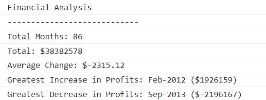

# Console-Finances

Creating a financial analysis tool using JavaScript

## Discription

The task is to write JavaScript code that analyzes the records to calculate each of the following:

- The total number of months included in the dataset.
- The net total amount of Profit/Losses over the entire period.
- The average of the changes in Profit/Losses over the entire period.
    - You will need to track what the total change in profits is from month to month and then find the average.
    - (Total/Number of months)
- The greatest increase in profits (date and amount) over the entire period.
- The greatest decrease in losses (date and amount) over the entire period.

When opening the code in the browser, the resulting analysis should print the analysis to the console and look similar to the following:

## Credits

Resources:
* https://developer.mozilla.org/en-US/docs/Web/JavaScript/Reference/Global_Objects/Array
* https://www.w3schools.com/jsref/jsref_push.asp
* https://www.tutorialspoint.com/How-to-format-a-number-with-two-decimals-in-JavaScript
* https://developer.mozilla.org/en-US/docs/Web/JavaScript/Reference/Global_Objects/Math/max
* https://developer.mozilla.org/en-US/docs/Web/JavaScript/Reference/Global_Objects/Math/min
* https://developer.mozilla.org/en-US/docs/Web/JavaScript/Reference/Global_Objects/Array/indexOf#:~:text=The%20indexOf()%20method%20returns,if%20it%20is%20not%20present.

## License

MIT License

Copyright (c) 2022 Jasmine

Permission is hereby granted, free of charge, to any person obtaining a copy
of this software and associated documentation files (the "Software"), to deal
in the Software without restriction, including without limitation the rights
to use, copy, modify, merge, publish, distribute, sublicense, and/or sell
copies of the Software, and to permit persons to whom the Software is
furnished to do so, subject to the following conditions:

The above copyright notice and this permission notice shall be included in all
copies or substantial portions of the Software.

THE SOFTWARE IS PROVIDED "AS IS", WITHOUT WARRANTY OF ANY KIND, EXPRESS OR
IMPLIED, INCLUDING BUT NOT LIMITED TO THE WARRANTIES OF MERCHANTABILITY,
FITNESS FOR A PARTICULAR PURPOSE AND NONINFRINGEMENT. IN NO EVENT SHALL THE
AUTHORS OR COPYRIGHT HOLDERS BE LIABLE FOR ANY CLAIM, DAMAGES OR OTHER
LIABILITY, WHETHER IN AN ACTION OF CONTRACT, TORT OR OTHERWISE, ARISING FROM,
OUT OF OR IN CONNECTION WITH THE SOFTWARE OR THE USE OR OTHER DEALINGS IN THE
SOFTWARE.

